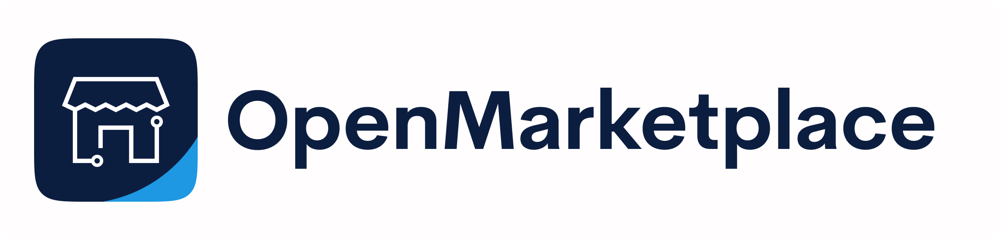
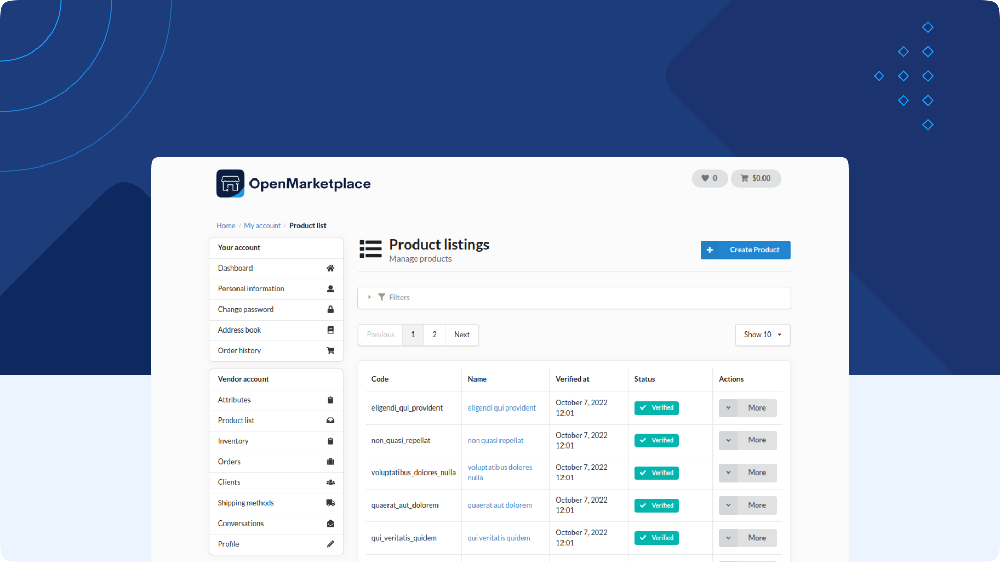

    

    
    
    

http://open-marketplace.io

BitBag OpenMarketplace is the first open-source marketplace platform. The solution is based on Sylius, Symfony and Semantic UI meaning it is fully compatible with each. The platform is highly customisable project made using full-stack BDD with Behat and PHPSpec.

Like what we do? Give us a star! ⭐

Looking for a professional team to build a MVM for your business on top of open-source? [Contact us!](https://bitbag.io/contact-us)

---

    

# Table of Contents

* [Overview](#overview)
* [Customization](#customization)
* [Contribution](#contribution)
* [Support](#we-are-here-to-help)
* [About us](#about-bitbag)
* [License](#license)
* [Authors](#Authors)
* [Contact](#contact)

# Overview

- [Installation](./doc/installation.md)
- [Vendor profile](./doc/vendor-profile.md)
- [Conversations](./doc/conversations.md)
- [Product Listing](./doc/product_listings.md)
- [Shipment](./doc/manage_shipping_methods.md)
- [Order Process](./doc/order_process.md)
- [Order management](./doc/manage_orders.md)
- [Conversations](./doc/conversations.md)
- [Customization](./doc/how_to_customize.md)

## Customization

Our project is highly customisable, [here](./doc/how_to_customize.md) is our guide on how to do it.

## Contribution

Every contribution is meaningful, kudos to everyone who helped us with developing this project! Issues and PRs are welcomed.

## We are here to help

This **open-source project was developed to help the Sylius community**. If you have any additional questions, would like help with installing or configuring the plugin, or need any assistance with your Sylius project - let us know! For community support, join the official [OpenMarketplace Community Slack](https://join.slack.com/t/openmarketplacegroup/shared_invite/zt-1ij1t41wx-HfAR6~URm3OAcqm0jc423Q).

If you want to participate in the development, you can do it by submitting [pull requests](https://github.com/BitBagCommerce/OpenMarketplace/pulls) or reporting [issues](https://github.com/BitBagCommerce/OpenMarketplace/issues).

## About BitBag

BitBag is a Software House working on digital commerce projects on top of best open-source technologies, such as Sylius, Shopware, Pimcore, Symfony and Vue Storefront. We work with worldwide companies who see eCommerce as an important factor of their strategy.

If you think we could help your business within the above-mentioned technology stack, contact us directly. We could be the right people to do the job. Fill the form on [this site](https://bitbag.io/contact-us/) or send us an e-mail at hello@bitbag.io.

## License

This project's source code is completely free and released under the terms of the MIT license.

## Authors

See the full list of contributors [here](https://github.com/BitBagCommerce/OpenMarketplace/contributors).

## Contact

You can contact us using the contact form on [our website](https://bitbag.io/contact-us/) or send us an e-mail to hello@bitbag.io with your question(s). We are also active on the [community Slack](https://join.slack.com/t/openmarketplacegroup/shared_invite/zt-1ij1t41wx-HfAR6~URm3OAcqm0jc423Q).

