## OpenMarketplace Api

OpenMarketplace is based on Sylius, and use Sylius's package
[SyliusApiBundle](https://github.com/Sylius/SyliusApiBundle). 
It supports REST Api in JSON.

### SyliusApi

For resources provided by Sylius, API is created by SyliusApiBundle
and the documentation is available [here](https://master.demo.sylius.com/api/v2/docs)
and at `/api/v2/docs` URL.

### Authorization
In order to authorization you need a JWT token. Use endpoint
(`/api/v2/shop/authentication-token`) with your credentials. 

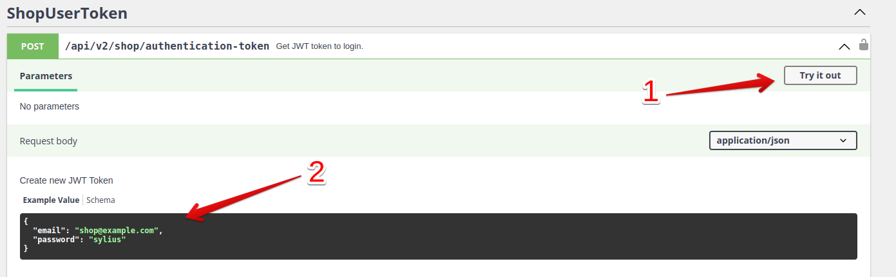

In the response, you will get a JWT token, and then you can set the authentication
token.

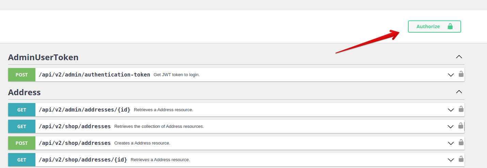
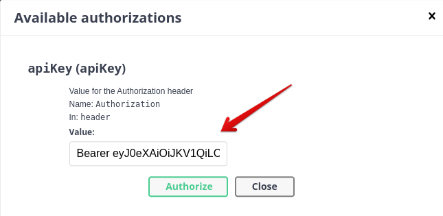

### Register as a vendor
Once you are an authorized user(1). Go to `/api/v2/shop/account/vendor/register`
endpoint and press button `Try it out`(2).

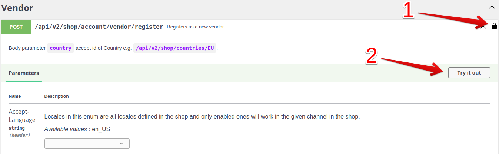

Fill in your data(1), and then execute(2).

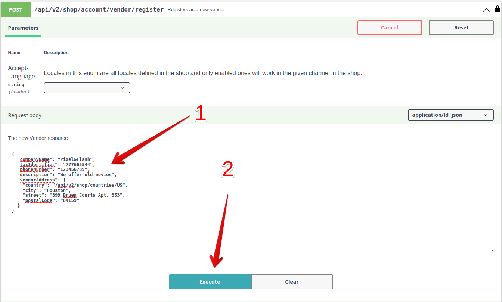

Now you have to wait for the administrator to accept your request to become vendor.

### Vendor Api
Vendors have access only to their resources.

#### Endpoints for managing details of Vendor.

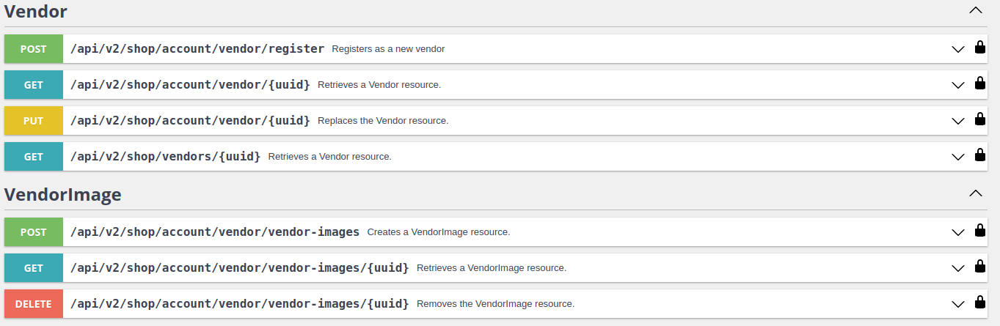
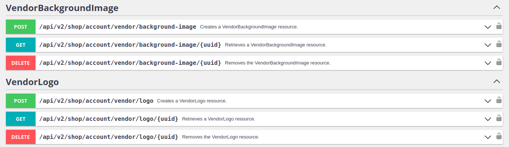

#### Endpoints for managing product listing resources, which converts to products after administration acceptance.

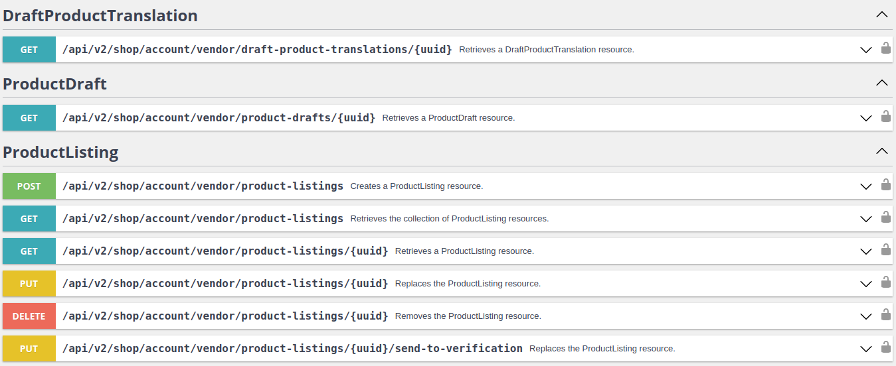
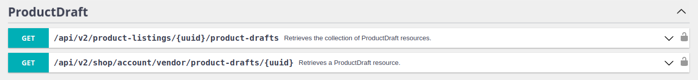
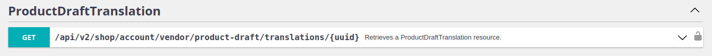

#### Endpoints for creating and managing attributes for Vendor's products.

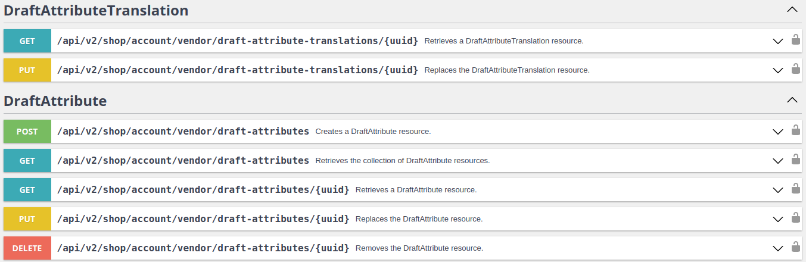

#### Endpoints that allow you to manage inventory of product variant.

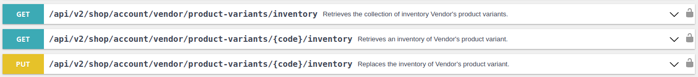

#### Endpoints for getting all your orders or get more details for one order only. 

You can also cancel the order.

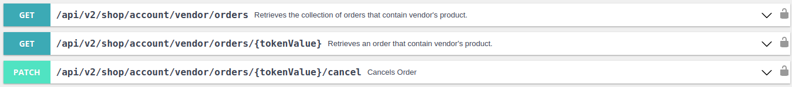

#### Endpoints for getting more details about customers who bought your products.

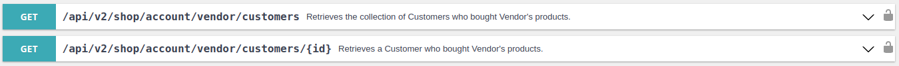
