##  Conversations

### Vendor side

---
Vendor can see conversation started by them or the administrator directly under the `Conversations` tab. 

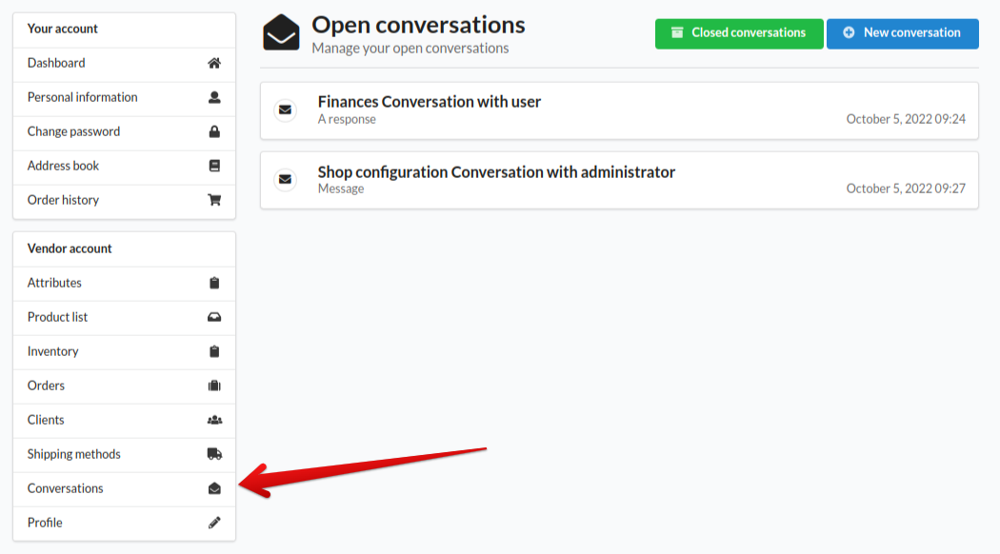

Under chosen conversation, vendor can see administrator messages or replies, and respond with a message and optionally submit with a file. 

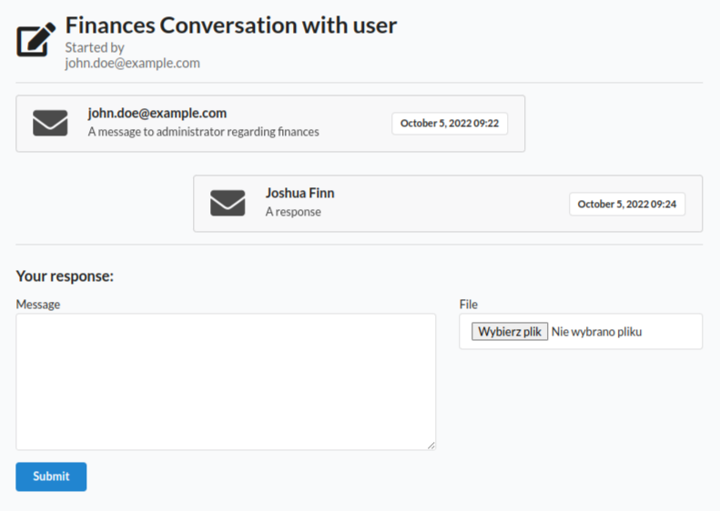

Vendor can start a conversation with administrator by clicking `New conversation` button.
The conversation form contains chosen category of the conversation, message and file field. 

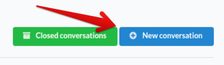
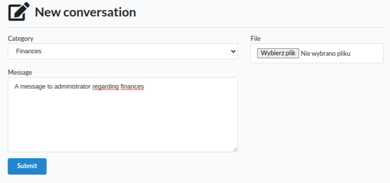

Conversations closed by administrator are available under `Closed conversations`

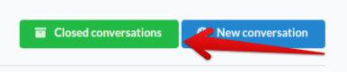

### Administrator side

---
As an administrator you have to go to admin panel and look for `Conversations` (1) under `Marketplace` category.
From there you can `Delete` or `Archive` (2) conversations.

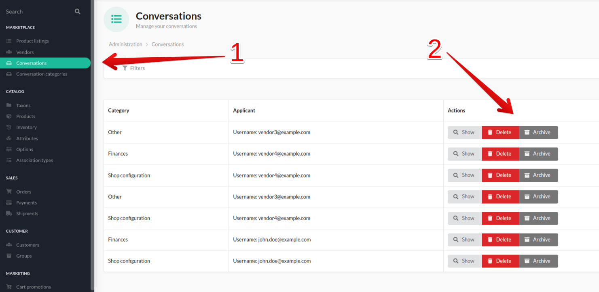

To respond to conversation, go to `Show` (1) and complete the form with a message (2) and optionally with a file (3).  

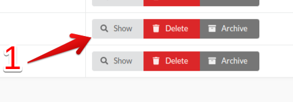
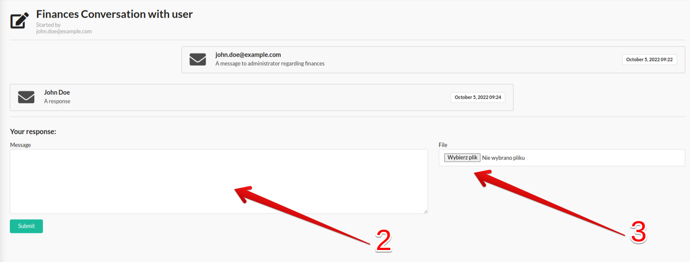

To create a conversation, go to `Create` and choose category of the conversation, the vendor and optionally a file.
Complete the form with a message. 

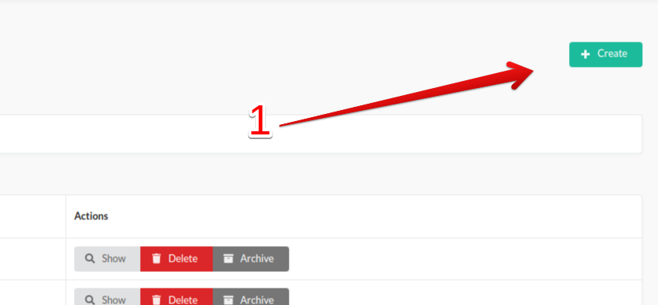

### Creating conversation category

---
Administrator can create, edit and delete conversation categories in `Conversation categories` under `Marketplace` category.

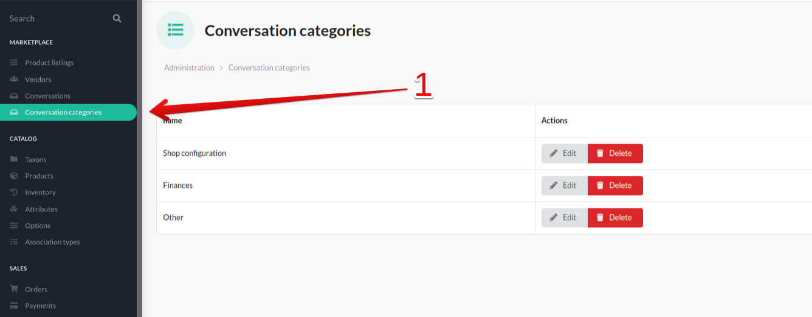

Create a new category by clicking `Create` and filling `Name` field

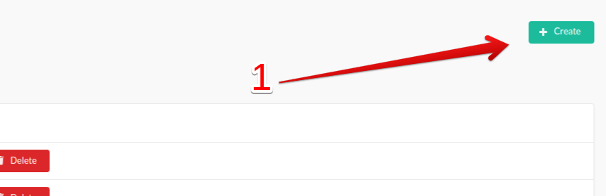
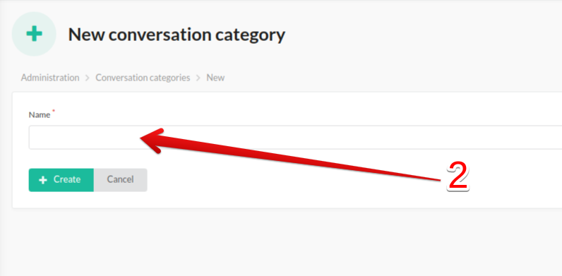

Now the category can be chosen in the conversation by the administrator and vendors.

