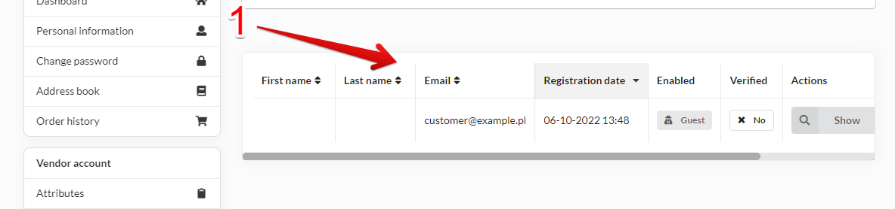

## Manage Clients

As a registered vendor, you can manage clients who have placed orders with you.

Clients you will find in vendor menu in your account (1).

### Clients List

On this section you will find yours clients list with basic data of each one.

### Manage each client

If you want see more details about client you can click show button(1) in actions column

In client details View you can see Customer data(1) and his address information(2).
You can also click show orders button to see his orders placed with you.

