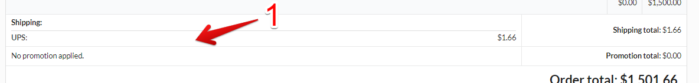
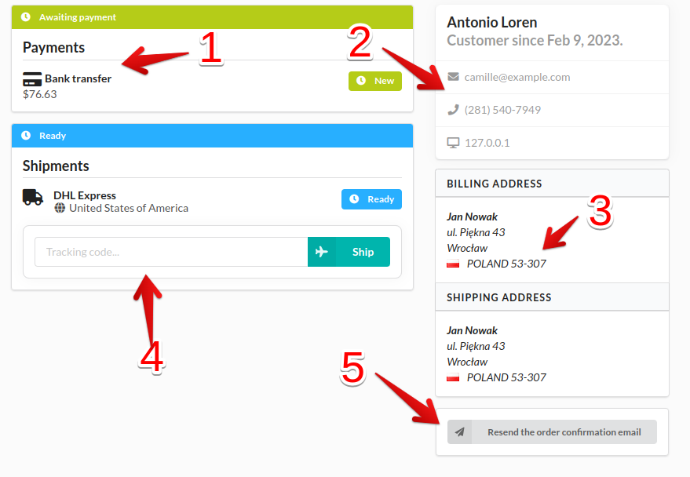

## Manage Client Orders

As a registered vendor, you can manage orders from your customers.

Orders you will find in vendor menu in your account (1).

### Orders List

In this section you will find orders list with its basic data respectively.

### Manage each order

If you want see more details of a given order you can click show button(1) in the actions column

In order details view you can see order info (1) and items (2).

Below there is information about shipping method (1).

Next information about `payments` (1), `customer` (2) and `adresses` (3).
You can also manage shipments (4) and resend confirmation email to client (5).

