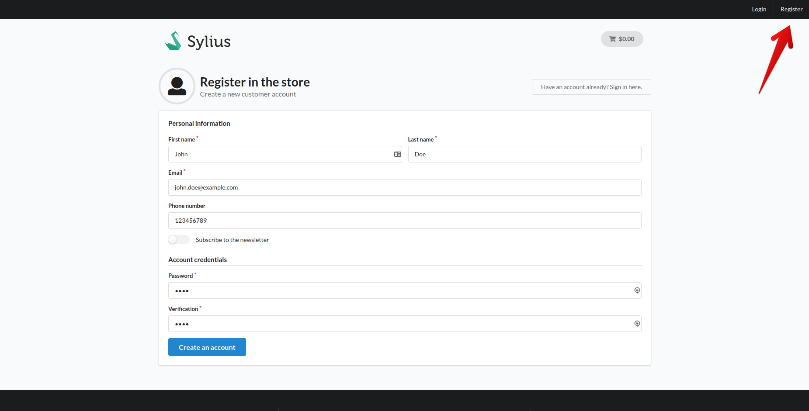
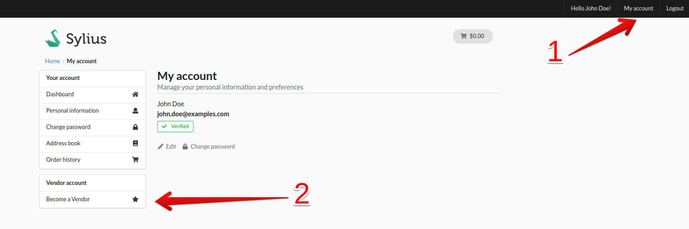
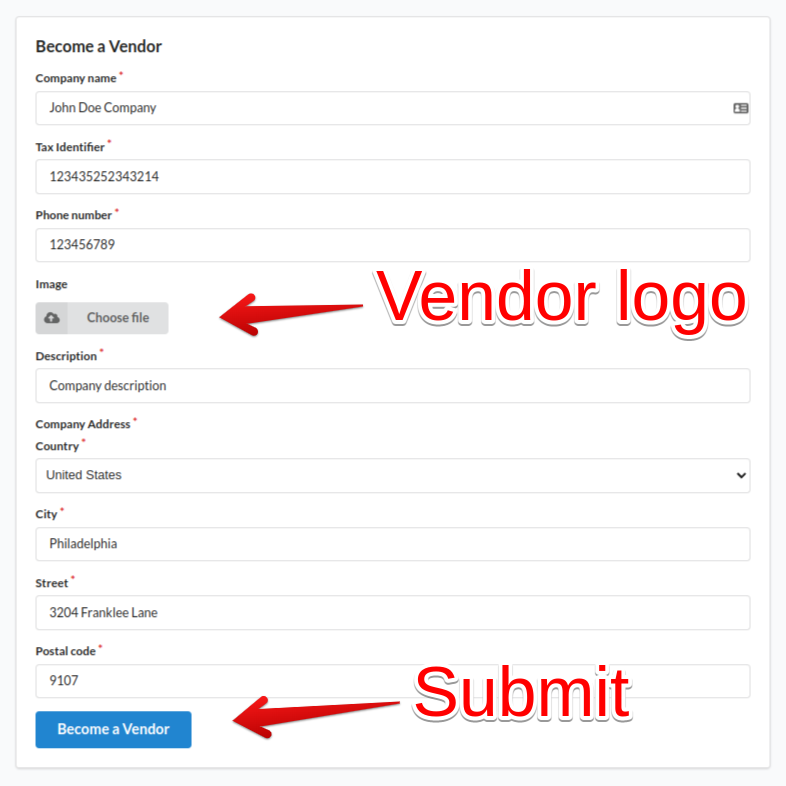
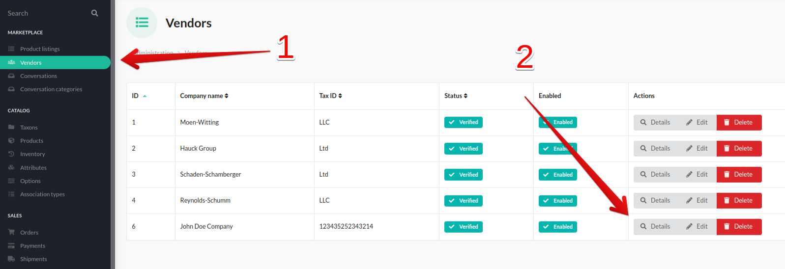
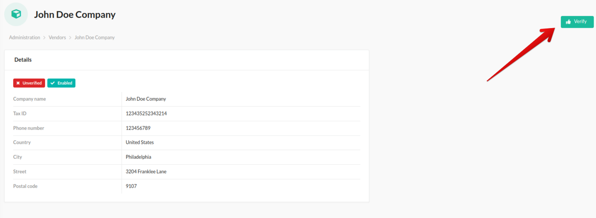
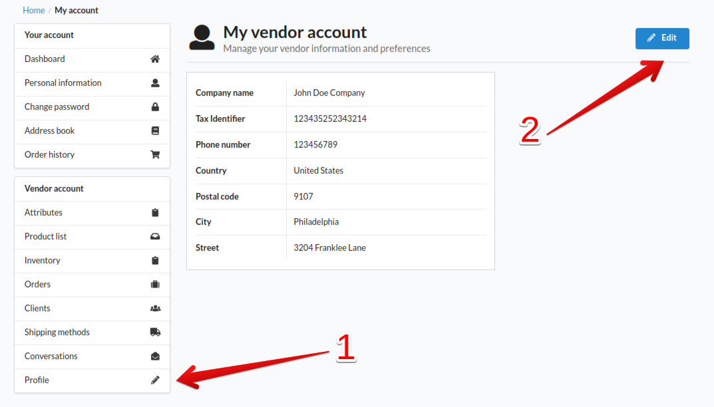
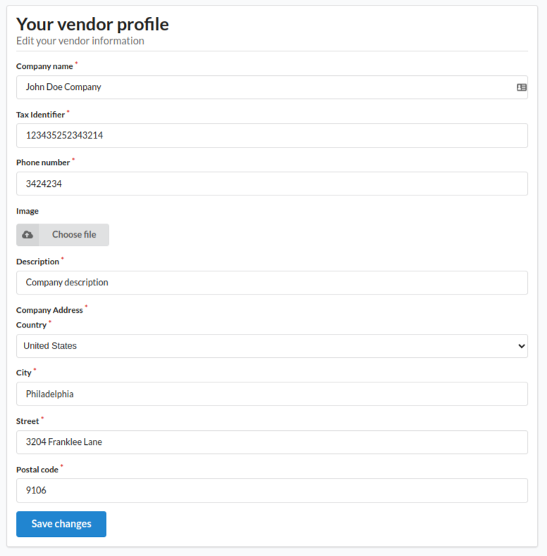
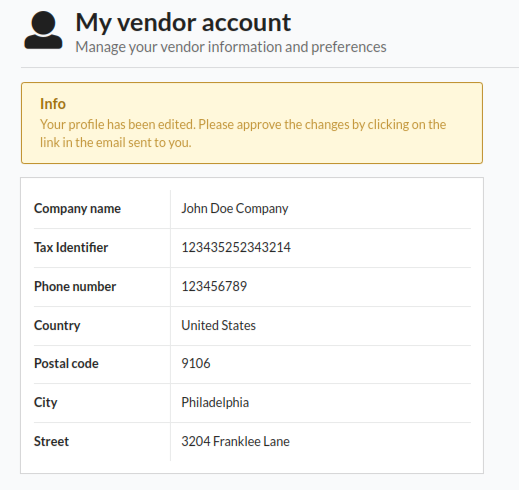
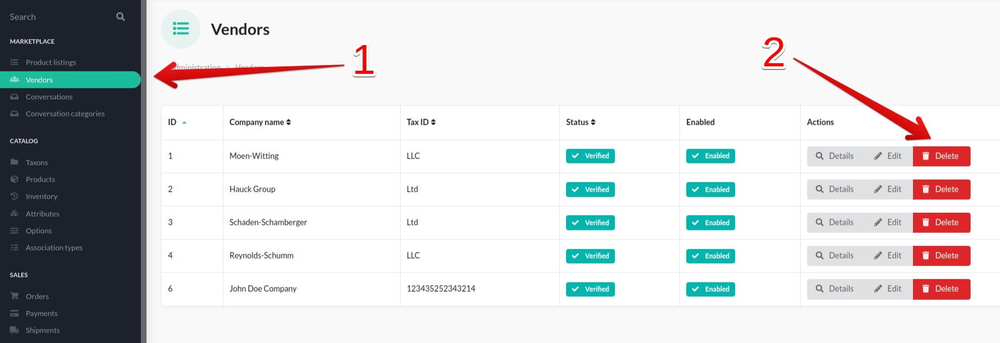
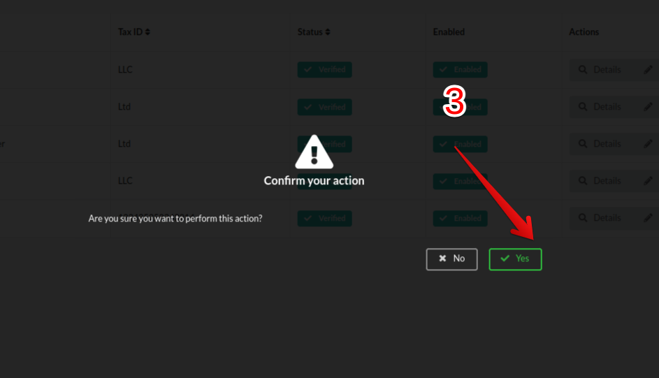

##  Vendor profile

### Becoming a vendor 

---
Firstly, you need to register as a user. To do it you have to click `Register` button and complete the form:

After sending the form and confirming registration through email, you need to log in and click `My Account` (1) to see your user profile.
Now you can see `Become a Vendor` (2) button. Click it and complete the form. 

Registration as a Vendor have to be accepted by the administrator. As an administrator you have to go to admin panel and look for `Marketplace` category.
Under `Marketplace` you can se `Vendors` (1) tab which contains all vendors registered whether they are verified or not. To verify a vendor you need to go to `Details` (2)
in their row and click `Verify` button. After completing this step, an email will be sent to vendor with information that they have been verified.

Verified vendor is able to see his panel which contains features such as attributes, product list, inventory,
orders, clients, shipping methods, [conversations](conversations.md), profile.

### Editing vendor profile

---
Vendor can edit his company data provided in registration in `Profile` (1) tab after clicking `Edit` (2) button. To confirm the submitted changes, vendor will need to click the link send via email. The appropriate message with the guidelines will be dispayed. 

Vendor has to confirm changes made in profile via email before editing it again.

### Deleting vendor 

---
Administrator can delete vendor by clicking `Delete` (2) button in admin panel under `Vendors` (1) tab in `Marketplace`.
After this, administrator will have to confirm this action by clicking `Yes` (3) in a pop up.

User account will not be deleted after this action, and the user can apply again to become a vendor (in their profile).

