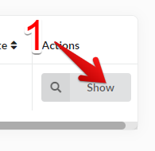

## Manage Client Orders

As a registered vendor, you can manage orders from your customers.

Orders you will find in vendor menu in your account (1).

### Orders List

On this section you will find orders list with basic data of each one.

### Manage each order

If you want see more details about order you can click show button(1) in actions column

In order details view you can see order info (1) and items (2).

Below is information about shipping method (1).

After that is information about payments (1).

You can also resend confirmation email to customer (1)

