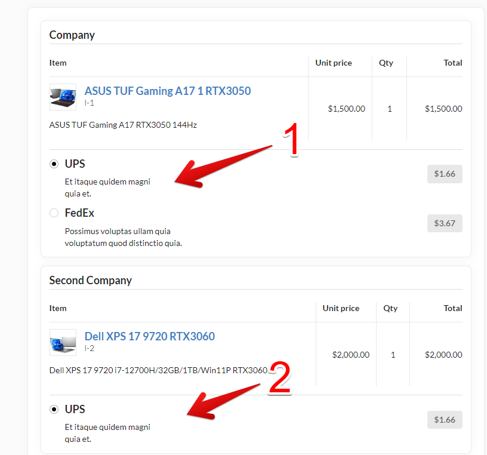

## Order process from several vendors

When a customer buys products from different vendors, they can choose the shipping method for each of them separately

the photo below shows the available shipping methods for the company "Company" (1) and for the company "Second Company" (2)

When customer place order each vendor will have separate order from this customer.

